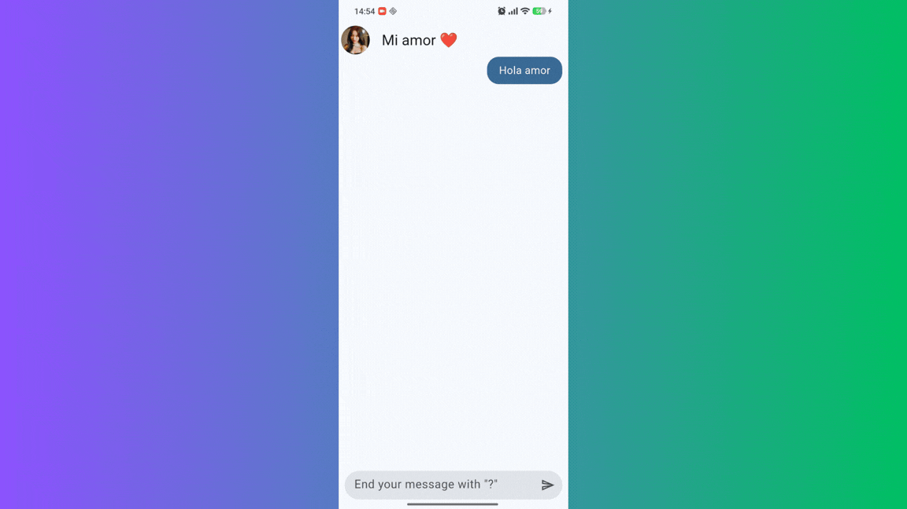

# 📱 YesNoApp - Flutter Chat Application

**YesNoApp** is an interactive mobile application built with **Flutter** and **Dart**. The app simulates a dynamic chat interface that consumes the public [YesNo API](https://yes-no-wtf.vercel.app) to fetch random affirmative, negative, or neutral responses along with animated GIFs.

This project is part of my mobile development learning journey through **DevTalles** (taught by Fernando Herrera).

---

## 📸 Demo & Preview

| Application View |
| :---: |
|  |

---

## ✨ Features & Key Learnings

- 🌐 **REST API Consumption:** Asynchronous HTTP requests (`async` / `await`) to an external web service.
- ⚙️ **State Management with Provider:** Efficient data flow handling and reactive UI updates.
- 🎨 **Reusable UI Components:** Custom modular widgets (`ChatBubble`, `MessageFieldBox`, etc.).
- 📦 **Data Modeling:** Parsing JSON responses into strongly-typed Dart objects using the `YesNoModel` class.
- 🔄 **Auto-Scroll Behavior:** Automated smooth scrolling to the latest message in the chat thread.

---

## 🛠️ Tech Stack

- **Framework:** [Flutter](https://flutter.dev/) (SDK >= 3.0.0)
- **Language:** [Dart](https://dart.dev/)
- **State Management:** [Provider](https://pub.dev/packages/provider)
- **HTTP Client:** [Dio](https://pub.dev/packages/dio) / [Http](https://pub.dev/packages/http)
- **External API:** [YesNo WTF API](https://yes-no-wtf.vercel.app)

---

## 🚀 Getting Started

Follow these steps to run the project locally:

1. **Clone the repository:**
```bash
git clone https://github.com/samuel-taya-dev/yes_no_app
```

2. **Navigate to the project directory:**
```bash
cd yes_no_app
```

3. **Install dependencies:**
```bash
flutter pub get
```

4. **Run the aplication:**
```bash
flutter run
```

---

## 👤 Author

Developed by **Samuel Taya**  
- **LinkedIn:** [Samuel Taya](https://www.linkedin.com/in/samuel-taya-dev)  
- **GitHub:** [@samuel-taya-dev](https://github.com/samuel-taya-dev)